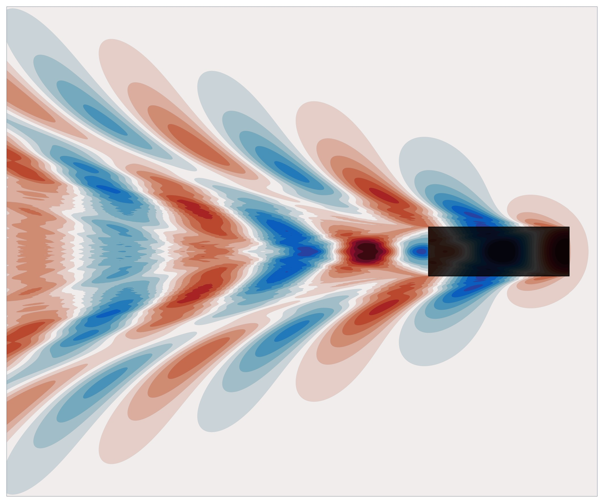

# KelvinFlatship

[](https://doi.org/10.5281/zenodo.19109463)



Julia repository for the paper: "Linear Kelvin Wave predictions as $z\to 0$"

This repository implements efficient numerical methods for evaluating the Kelvin Green's function and its line integral, which arise in the Neumann-Kelvin boundary value problem for ship waves. The preprint can be [read online](https://arxiv.org/abs/2603.14945).

All figures can be reproduced using the scripts in the `make_figures` folder. The benchmark table can be reproduced using `make_figures/table.jl`, although timing results will vary by machine. Each script in `make_figures/` is self-contained. From the repository root:

```julia
include("make_figures/wave_field.jl")   # wave field plots
include("make_figures/wavedrag.jl")     # wave drag vs Froude number
include("make_figures/spectrum.jl")     # wave spectrum
include("make_figures/dphase.jl")       # phase convergence
include("make_figures/table.jl")        # accuracy and timing benchmarks
```

### Dependencies

Julia's package manager will download all the dependencies listed in `Project.toml` automatically:

```julia
] instantiate
```

Key dependencies: `NeumannKelvin`, `QuadGK`, `TupleTools`, `SpecialFunctions`, `ForwardDiff`, `BenchmarkTools`.

If you use this work, please cite the paper. The repository itself can be cited via the DOI badge above.

## Repository structure

```
src/
  PointSource.jl    # wavelike() — point-source wavelike Green's function
  flatship.jl       # ∫₂wavelike() — line-integrated wavelike Green's function
  specialdiff.jl    # ForwardDiff extensions for complex Bessel functions

make_figures/
  wave_field.jl     # Figure: wave field for planing hull at several aspect ratios
  wavedrag.jl       # Figure: wave drag coefficient vs Froude number
  spectrum.jl       # Figure: wave spectrum
  dphase.jl         # Figure: phase convergence diagnostics
  table.jl          # Table: accuracy and timing benchmarks
```

### `src/PointSource.jl` — point-source wavelike Green's function

Provides `wavelike(x, y, z; kwargs...)`, which evaluates the wavelike part of the Kelvin Green's function:

$$W(x,y,z) = 4H(-x)\int_{-\infty}^{\infty} \exp\bigl(z(1+t^2)\bigr)\sin\bigl(g(x,y,t)\bigr)\,dt$$

where $g(x,y,t)=(x+yt)\sqrt{1+t^2}$ and $H$ is the Heaviside function. The integral is evaluated using a modified steepest descent method: stationary points of $g$ are located, smooth finite-range integrals around them are evaluated with Gauss-Kronrod quadrature, and the highly oscillatory semi-infinite tails are handled by numerical steepest descent. An optional weight function `γ` allows slowly-varying pre-factors to be included.

This builds on the internal routines of [NeumannKelvin.jl](https://github.com/weymouth/NeumannKelvin.jl) and extends them with a cleaner interface and the `γ` weight option.

### `src/flatship.jl` — line-integrated wavelike Green's function

Provides `∫₂wavelike(x, y, z; b=1, kwargs...)`, which evaluates the elliptically-weighted line integral:

$$\int_{-b}^{b} \sqrt{1-(y'/b)^2}\; W(x,y-y',z)\; dy' = 4\pi H(-x)\int_{-\infty}^{\infty} \frac{J_1(bk(t))}{k(t)}\exp\bigl(z(1+t^2)\bigr)\sin\bigl(g(x,y,t)\bigr)\,dt$$

where $k(t)=t\sqrt{1+t^2}$ and $J_1$ is the Bessel function of the first kind. The $y'$ integration is performed analytically via the Fourier transform of the elliptic distribution, giving the $J_1/k$ prefactor. The Bessel function is decomposed into scaled Hankel functions $Hx_1^{(1,2)}$, which serve as slowly varying prefactors for the steepest descent path integration.

### `src/specialdiff.jl` — automatic differentiation support

Extends `SpecialFunctions.besselj1` and `SpecialFunctions.besselhx` to accept complex `ForwardDiff.Dual` inputs, using the analytic derivatives

$$\frac{d}{dz}J_1(z) = J_0(z) - \frac{J_1(z)}{z}, \qquad \frac{d}{dz}Hx_1^{(k)}(z) = Hx_0^{(k)}(z) - \left(\frac{1}{z} \pm i\right)Hx_1^{(k)}(z)$$

This enables wave elevation computation via automatic differentiation of the potential with respect `x` and could be used, for example, to take wave-drag derivatives with respect to length as well.

## Figure scripts

### `make_figures/spectrum.jl`

Plots the transverse wave cut $\zeta(y)$ at fixed $x$ for the point-source $W$ at several depths $z$, and for the line-integrated $\int_2 W$ at $z=0^-$, using $\partial_x$ via `ForwardDiff`. The spectral density of each wave cut is computed using the Hilbert transform (`DSP.hilbert`) and plotted against spanwise wavenumber $k_y$, showing the $k_y^{-3/2}$ spectral roll-off and the regularising effect of the $J_1/k$ prefactor at $z=0$.

### `make_figures/dphase.jl`

Assesses the accuracy of the steepest descent integration as a function of the finite phase range $\Delta g$ (the phase window around each stationary point used for real-line quadrature before switching to the complex path). Two plots are produced: one sweeping $\Delta g$ for several depths and one comparing Gauss-Laguerre quadrature orders $N \in \{2, 4, 8\}$ for the tail integration at a fixed near-surface depth.

### `make_figures/table.jl`

Benchmarks `∫₂wavelike` against brute-force Gauss-Kronrod quadrature of the direct $y'$ integral, at five values of $y$ spanning the interior and exterior of the Kelvin wake. Reports absolute error, relative error, wall-clock time, speedup over brute force, and slowdown relative to the point-source `wavelike`.

### `make_figures/wave_field.jl`

Computes the free-surface wave elevation $\zeta$ for point-source and regularized line-source using `wavelike` or
`∫₂wavelike`, including the nearfield term via `nearfield` from `NuemannKelvin.jl`, and `ForwardDiff` for the x-differentiation differentiation. Produces contour plots for $b \in \{0.5, 1, 2\}$, a 3D surface plot, a point-source surface for comparison, and the graphical abstract image. Multi-threaded over the spatial grid using `AcceleratedKernels`.

### `make_figures/wavedrag.jl`

Computes the wave drag coefficient $C_W$ as a function of hull length $L$ and half-beam $b$ by integrating the squared $J_1/k$ spectrum against the longitudinal wave number kernel $k_x(t)(1-\cos(L\sqrt{1+t^2}))$. Produces a filled contour plot of $C_W / 8\pi q_0^2$ over the $(L, b)$ parameter space.
